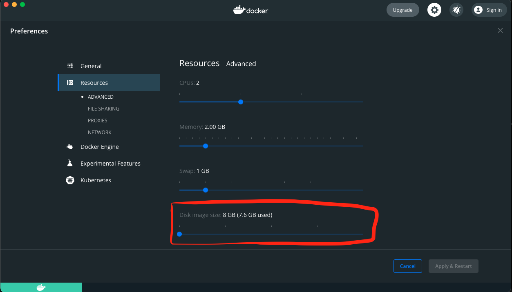

# MyUsers.io - web/os testing software [WIP]

My users studio is a free web/os testing software based on electron and docker that aims to automate tests on websites in the most relible, easy and user friendly way.

## link to video showcasing 
   https://www.youtube.com/watch?v=_btkOUCMOok  
  
## Trello 
   https://trello.com/myusersio

## Myusers player server example 
   https://github.com/yonischeyer1/myusersplayer
## Myusers allows you to :

1. Automate Tests on your website without the need to know how to code.

2. Automate Tests on your website without the need to add spacial attributes to your html elements.

3. Automate Tests on your website on production environments.

4. Run tests in a schedule

5. Interact with tests when live actions required

6. Automate tests on any environment/os that supports vnc and java.

7. Automate Tests on 3rd party websites

8. You can record intractions with any website and play it later multiple times one after the other and in parallel (dependes on host resources).

9. export tests as files and play them programmatically via sdk or import them to myusers studio   

## GOALS:

### SINGULARITY AND BEETER ACCESABILLTY 

The tests files can be used in a group to create my users testing applications.
That can improve accessibility for users by recoerding complex functions and make it work with just a single button or interface.
Or it can group togther multiple 3rd party websites functionalties into the same interface.
  

### Manual QA booster :

QA will no longer have to run smoke tests and regression tests before each release she/he/it/them/they can just hit play on the test suite and let the software do its thing.

Or tests can be integrated in the CI pipeline as a regular tests would be.

This will let a Manual QA to focus on new features to be released.

  
  

### 0 reoccurring bugs :

Devs can either play pre recorded tests sent from QA or record tests themselves.

That way we can assure a more productive less buggy delivery of code by the developer.

  

### More comprehensive test reports :

I presume the tests reports can improve and give more detailed info like :

*what exactly changed in the design - color , placement , text etc

*list all features with performance issues with metrics.

*AI that learns previous reports and gives insights (ex: suggest the best developer for each feature).

  

### R&D SCORE :

If every website owner starts using this testing software we can accumulate a score for each website that will give us some kind of “R&D” score

That will be composed from the automated tests results and reports

  
 ## How it works  :
  Myusers.io studio is using image matching as its validation mechnasim, it records mouse and keyboard intercations and images from the recorded targetd website and when playing this intractions on the targeted website the software checks if there was a match between the image in the time of the recoerding and the image that in now presented in the playing session.


## Detailed :

  

1. Runing a container containing xvfb running chromium/Iceweasel and vnc

2. Connecting to the container vnc connection from host and Recording on that container mouse and keyboard actions with Java native hook library

3. Playing on that container the mouse and keyboard actions with Java robot library.

4. Make user validate the actions via video (recording sometimes glitch so as patch solution you can try re-recording and get it right until i improve the recording mechanism)

5. Play validated actions inside container And capture screen shots before each user mouse click or enter keystroke and create a reference perceptual hash out of it.

6. Play actions with java robot library on the container and before every click Eyes will take screenshot of the browser and calculate levenstien distance between the perceptual hash of the current screenshot and the orginal validated recored session screenshot of that action.

7. If distance between the hashes is not 0 the test failed if it is 0 test succeeded.

8. troubleshoot menu guidenece if test failed to either try solve the test issue or report a bug.

## Troubleshoot Menu options :

  This interactive menu guides the user on how to correct a failed test with one of the tools available or report it via email/ ticketing system API etc.

### Dynamic snapshot :

#### Problem:

When a tag snapshot has changing parts in the UI its confusing the snapshot matching server (eyes).

#### Solution:

You can open a static masking wizard in order to cover those dynamic parts (ex: counter badge component, updated list etc).

### UI Change:

#### Problem:

The website UI has changed to this snapshot.

#### Solution:

Replace current tag image with the failed tag image.

  

### Performance issue / slowness:

#### Problem:

Internet speed change / much traffic on the website / bug causing slowness

#### Solution:

You can increase the wait time of each tag and number of attempts.

  

### Bug:

#### Problem:

As a QA your point of reference to check that the website behaves as it should is the Features user stories

When you do detect an exception in behaviour you should report it to a ticketing system

#### Solution:

Report to your favorite ticketing system.

  

### A/B Test

#### Problem: 
There can be multiple themes for the same interface but elements and layout you did an action on stay in their position.

#### Solution:
 You can add this snapshot to the tag and it will check to see of one of the options is correct

### Skip

You can skip tag snapshot matching (Be carful with this option it can lead to unexpeceted behaviour).

  

### Live Snapshot

If there is a match the test will wait for live action input from the user and after the user finished it will continue from where it stopped


## Terminology :

#### Action: 
 Containing tags and mouse and keyboard actions from myusers recording session.

#### Tags: 
Array of screenshots from a validated Action recording session.

#### Eyes: 
A server that runs inside the container and matches tags one by one against  screenshots of actions taken at real time of playing the test.

#### Hands: 
A server that runs inside the container that either records keyboard and mouse actions or plays them.
  

## Install
You need docker to be installed on the host


Add ’sessions’ folder inside the app folder
Add DB folder with all entities - 
accounts.json, actions.json, tests.json, users.json, settings.json
Each file should contain empty brackets {}

## Important !

on mac os each time a container runs is takes up much space from the system 
to mitigate make sure your docker daemon disk image size is set to the minimum :




## Must install packages 

### Raspberry pi 
```bash 
$ sudo apt-get update 
$ sudo apt-get install build-essential libcairo2-dev libpango1.0-dev libjpeg-dev libgif-dev librsvg2-dev
```
### Apple m1 chip 

```bash 
$ brew install build-essential libcairo2-dev libpango1.0-dev libjpeg-dev libgif-dev librsvg2-dev
```

if sharp giving errors when trying to install inside src / app folder package.json try to relink it via “brew link <the package giving issues> —dry-run”


### Build iocore jar

Note ! if your developing on arm64 you need to download the latest jnativehook and add it manually from :
  https://oss.sonatype.org/content/repositories/snapshots/com/github/kwhat/jnativehook/2.2-SNAPSHOT/
and use branch m1_adjust_for_dev dockerfile
```bash

Open java-core folder with intellij
Create artifact (make sure you save manifest in resources folder)
Build artifact and copy the jar file output to dockerMeta folder in GUI/app/dockerMeta
```
### GUI
```bash
cd GUI
yarn
cd app
yarn 
cd ..
yarn run dev

```
If the following error shows - 
“failed to solve with frontend dockerfile.v0: failed to create LLB definition: failed to do request: context canceled”
run the following commands in the Terminal
export DOCKER_BUILDKIT=0
export COMPOSE_DOCKER_CLI_BUILD=0

## ROADMAP
1. Add option to create a mask preset ex : there are changing parts in the browser itself that can cause a test to fail. we can create preset browser default mask to cover address bar and route display (and blinking cursor at search bar) at the bottom of the page that way we make sure the browser itself won’t break the test.
2. Add random mouse movement when recording user not moving its mouse for x ms.
3. Add test total time is test list row 
4. Profit 
## Docs

  

To be published

  

## Maintainers

  

- [Yoni.s](https://github.com/yonischeyer1)
- [DanaShak](https://github.com/DanaShak)

  

## License

  

GPL-V3

